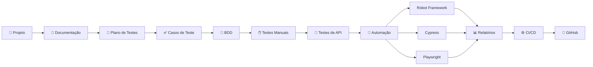
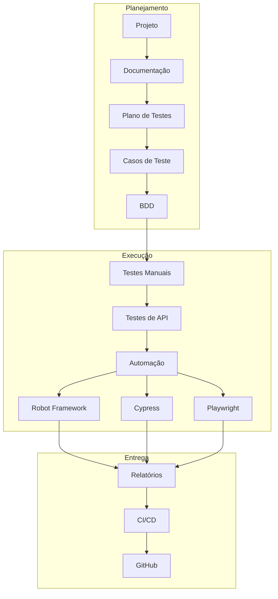

# ROADMAP - Qualidade de Software

A estrutura faz sentido como um roadmap prático para aprender e montar um portfólio de QA.

Uma sequência mais completa seria:

1. Escolha um projeto (como o [serverest.dev](https://serverest.dev/)).
2. Entenda os requisitos e as regras de negócio.
3. Crie a documentação do projeto.
4. Elabore o plano de testes (escopo, estratégia e critérios).
5. Escreva os casos de teste.
6. Crie os cenários em BDD [Gherkin](https://cucumber.io/docs/gherkin/reference).
7. Execute os testes manuais. O Serverest possui um [front end](https://front.serverest.dev/login)
8. Reporte e acompanhe os bugs encontrados.
9. Faça os testes de API ([Postman](https://www.postman.com/), [Bruno](https://www.usebruno.com/), [Insomnia](https://insomnia.rest/) ou automatizados).
10. Automatize os testes:

    * [Selenium](https://www.selenium.dev/)
    * [Cucumber](https://cucumber.io/)
    * [Robot Framework](https://robotframework.org/)
    * [Cypress](https://www.cypress.io/#create)
    * [Playwright](https://playwright.dev/)

11. Gere relatórios de execução. (Allure)
12. Configure CI/CD (por exemplo, GitHub Actions).
13. Versione todo o projeto no GitHub.

Eu também organizaria os diretórios do repositório de forma clara, por exemplo:

```text
📁 .github/workflows/
📁 api-tests/
📁 automation/
   ├── robot/
   ├── cypress/
   └── playwright/
📁 bdd/
📁 docs/
📁 manual-tests/
📁 reports/
📁 test-cases/
📁 test-plan/
README.md
```

Esse fluxo tem uma vantagem importante: mostra que você sabe trabalhar como um QA completo, passando por todas as etapas do processo, e não apenas pela automação.

Em resumo, o roadmap ficaria assim:



As fases de **Planejamento**, **Execução** e **Entrega**.



Esse é um roteiro bastante sólido para estudo e para montar um portfólio que demonstra competências em QA manual, testes de API, automação e integração contínua.
